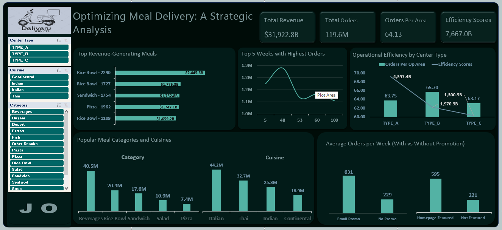

# Meal Delivery Analysis

This repository contains the SQL queries used to uncover key operational insights for a meal delivery service — including scaling performance, improving efficiency, and analyzing the impact of promotional campaigns. 

## 📁 Files Included

- `data_cleaning.sql` – Queries used to clean and prepare the dataset.
- `exploratory_analysis.sql` – Queries used to uncover insights on meal demand, center performance, and promotional impact.
- `dashboard_screenshot.png` – Visual snapshot of Excel dashboard.

## 🔍 Key Insights

- **Rice Bowls** dominate in revenue, with one meal alone generating over ₦2.4B. **Beverages** drive the highest total revenue due to consistent volume across orders.
- **Promotions** increased weekly orders nearly 3x, but unregulated discounting suggests revenue leakage. Targeted, margin-aware strategies are needed.
- **Center Type A** is the most scalable — balancing high order volume and coverage with strong operational efficiency.
- **Order spikes** in Weeks 5, 48, 53, and 60 hint at seasonal or event-driven demand. This calls for smarter forecasting and promotional alignment.
- **Italian meals** and **Beverages** show sustained appeal, supporting a strategy that balances flagship items with volume drivers.

  ## 📊 Dashboard Preview

## Documentation

👉 [Read the full analysis and recommendations on Medium](https://medium.com/@opadojajoshua/optimizing-meal-delivery-a-strategic-analysis-0d2e637f68e3)  
(Includes detailed thought process, reasoning behind key insights, and strategic takeaways)

 ## ⚠️ Data Limitations

This analysis was conducted with a few key constraints that limit certain conclusions:

1. **Missing Year Information in Weekly Data**  
   Week numbers spanned over 145 values, suggesting multiple years, but no year data was included.  
   _🔍 Impact: Prevents accurate trend or seasonality analysis across years._

2. **No Cost or Profit Margin Data Per Meal**  
   The dataset lacked true unit costs, waste data, or profit margin metrics for individual meals.  
   _🔍 Impact: Limits financial depth and confidence in promotion/profitability recommendations._

3. **Absence of Delivery Timing or Delay Metrics**  
   No timestamps for dispatch or delivery were available.  
   _🔍 Impact: Restricts analysis on logistics, timeliness, and customer satisfaction._

##  🛠️ Tools Used

- SQL (Data Cleaning & Analysis)
- Excel (Dashboard & Visualizations)

## 👤 Author

**Joshua Opadoja**  
Data Analyst | Solving problems using data and code
 
 🔗 [LinkedIn](https://www.linkedin.com/in/joshua-opadoja-5682592b5)
 🔗 [X(Twitter)](https://x.com/JDataCraft?t=lf1r_jM5QHj6FRG15XdNTA&s=09)
